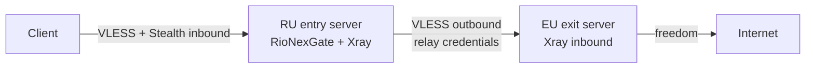
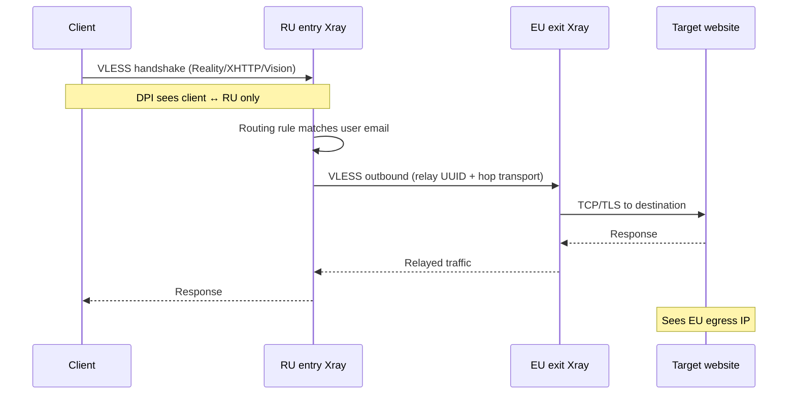

**English** | [Русский](multihop.ru.md)

# Multi-hop chains (RU entry → EU exit)

RioNexGate supports **entry → exit** proxy chains: clients connect only to the **entry** node (for example a server in Russia), while traffic exits to the Internet from the **exit** node (for example a server in the EU). The panel on the entry server generates Xray outbounds that relay user traffic to registered exit nodes.

This guide is the comprehensive reference for designing, deploying, operating, and troubleshooting multi-hop topologies. It is based on the implementation in `backend/internal/core/multihop.go`, `backend/internal/core/templates/xray.json.tmpl`, `backend/internal/models/node.go`, and the Nodes / User chain UI.

> **Scope:** Multi-hop outbound and routing generation is implemented for **Xray-core** (`core.type: xray`). The sing-box template does **not** emit chain outbounds — use Xray on the entry server for multi-hop. See [Limitations](#limitations).

---

## Table of contents

1. [Glossary](#glossary)
2. [Architecture](#architecture)
3. [Network and firewall matrix](#network-and-firewall-matrix)
4. [Deployment topology](#deployment-topology)
5. [Full deployment walkthrough](#full-deployment-walkthrough)
6. [Credentials JSON reference](#credentials-json-reference)
7. [Xray config anatomy](#xray-config-anatomy)
8. [Panel UI guide (`/nodes`)](#panel-ui-guide-nodes)
9. [User chain assignment](#user-chain-assignment)
10. [Subscription and client behavior](#subscription-and-client-behavior)
11. [Stealth and multi-hop combined](#stealth-and-multi-hop-combined)
12. [Configuration examples](#configuration-examples)
13. [API reference](#api-reference)
14. [Verification procedures](#verification-procedures)
15. [Troubleshooting](#troubleshooting)
16. [Security notes](#security-notes)
17. [Production checklist](#production-checklist)
18. [FAQ](#faq)
19. [Limitations](#limitations)
20. [See also](#see-also)

---

## Glossary

| Term | Definition |
|------|------------|
| **Entry node** | The client-facing hop. Users connect here with VLESS (optionally Reality / XHTTP / Vision). Stored in the `nodes` table with `role: entry`. Client links, QR codes, and subscriptions always resolve to the entry `address:port`. |
| **Exit node** | The Internet egress hop. The entry server's Xray opens a VLESS outbound to this host using relay credentials stored in the exit node record. Stored with `role: exit`. Never exposed to clients. |
| **Relay user** | A dedicated VLESS user on the EU exit inbound whose UUID is copied into the exit node's `credentials.uuid` on the RU panel. Not the same as end-user UUIDs. |
| **Chain tag** | Xray outbound tag for the chained freedom outbound: `exit-<name>-chain`, where `<name>` is the unique exit node `name` field. Routing rules send user traffic to this tag. |
| **Outbound tag** | The direct VLESS outbound tag to the exit: `exit-<name>` (from `Node.OutboundTag()`). The `-chain` outbound proxies through this tag via `proxySettings`. |
| **`local_role`** | Field in `core.multihop` (`entry` or other). Only `enabled: true` **and** `local_role: entry` triggers `BuildMultihopData` and chain generation (`MultihopConfig.IsEntryNode()`). |
| **Auto resolution** | When a user has no explicit `entry_node_id` / `exit_node_id`, the panel picks the **lowest `priority`** among **active** nodes of that role (`ORDER BY priority ASC, id ASC`). |
| **`ResolveClientEndpoint`** | Go function that returns `{Host, Port}` for client-facing output. Uses the resolved entry node if present; otherwise falls back to `core.public_host` and `core.listen_port`. Exit nodes are never passed in. |

---

## Architecture

### High-level flow



### Connection sequence



ASCII equivalent:

```
  Client
    |
    |  VLESS (+ Reality / XHTTP / Vision per core.stealth)
    v
  +---------------------------+
  | RU entry server           |
  | RioNexGate panel + Xray   |
  | - user inbounds           |
  | - multihop outbounds      |
  +---------------------------+
    |
    |  VLESS to exit node (stored credentials)
    v
  +---------------------------+
  | EU exit server            |
  | Xray inbound (relay user) |
  +---------------------------+
    |
    v
  Internet (EU egress IP)
```

**What clients see:** subscription links, QR codes, and RioNexTunnel configs point at the **entry** host/port only (`ResolveClientEndpoint`). Exit nodes are never published to clients.

**What the entry Xray config contains:** for each active exit node used by at least one active user, the generator adds:

1. A **VLESS outbound** to the exit `address:port` with credentials from the node record (tag: `exit-<name>`).
2. A **freedom outbound** with `proxySettings` chaining through that VLESS outbound (tag: `exit-<name>-chain`).
3. A **routing rule** mapping user emails to the chained outbound tag (`exit-<name>-chain`).

See [`backend/internal/core/templates/xray.json.tmpl`](../backend/internal/core/templates/xray.json.tmpl) and [`multihop.go`](../backend/internal/core/multihop.go).

---

## Network and firewall matrix

### Port reference

| Port | Protocol | Direction | Service | Notes |
|------|----------|-----------|---------|-------|
| **443** | TCP | Client → RU | XHTTP + Reality inbound (typical) | Primary stealth port when `core.stealth.xhttp.enabled: true` |
| **8443** | TCP | Client → RU | Vision + Reality inbound (typical) | Secondary stealth port when `core.stealth.vision.enabled: true` |
| **2053** | TCP | Client → RU | VLESS + TLS inbound (optional) | When `core.stealth.tls.enabled: true`; supports fragmentation |
| **8888** | TCP | Admin → RU | RioNexGate panel (nginx) | Change via `HTTP_PORT` in `.env`; use HTTPS in production |
| **8080** | TCP | Local / debug | Backend API direct | Not required externally when nginx proxies `/api` |
| **8443** (example) | TCP | RU → EU | Exit relay inbound | Match exit node `port` and EU Xray inbound; Vision is common |
| **443** (alternate) | TCP | RU → EU | Exit relay inbound | Use if EU listens on 443 instead of 8443 |
| **10085** | TCP | Docker internal | Xray stats API | `core.xray.api_address`; not client-facing |

### Firewall rules (minimum)

| Rule | Source | Destination | Port | Action |
|------|--------|-------------|------|--------|
| Client access | Internet / user networks | RU public IP | 443, 8443 (+ TLS port if used) | ALLOW |
| Inter-node relay | RU private/public IP | EU public IP | Exit node port (e.g. 8443) | ALLOW |
| Panel admin | Your admin IP(s) | RU public IP | 8888 or HTTPS | ALLOW (restrict source) |
| EU panel (optional) | Your admin IP(s) | EU public IP | 8888 | ALLOW only if RioNexGate runs on EU |
| Block EU clients | Internet | EU public IP | 443, 8443 | DENY if EU is relay-only (recommended) |

### Connectivity checks

From the **RU entry server**:

```bash
# TCP to EU relay port (replace host/port)
nc -zv eu.example.com 8443

# DNS resolution
dig +short eu.example.com

# Latency (health check uses 5s dial timeout)
time nc -zv eu.example.com 8443
```

From a **client workstation**:

```bash
# Entry stealth ports
nc -zv ru.example.com 443
nc -zv ru.example.com 8443
```

---

## Deployment topology

| Server | Role | RioNexGate panel | `core.multihop` | Purpose |
|--------|------|------------------|-----------------|---------|
| RU | Entry | **Yes** (primary) | `enabled: true`, `local_role: entry` | Client-facing inbounds, chain management, outbound to EU |
| EU | Exit | Optional (local admin) | `enabled: false` (or omit) | Relay inbound for entry server; traffic exits to Internet |

The **management panel lives on the entry server**. Exit servers only need a matching Xray inbound for the relay credentials you store in the exit node record. Running RioNexGate on the EU host is convenient for user/credential management but not required for the chain itself.

### When to register an entry node

An entry node record is **optional** but recommended when:

- `core.public_host` differs from the hostname clients should use (CDN, anycast, multiple RU IPs).
- You run multiple entry servers and want per-user entry assignment.
- You want the `/nodes` topology diagram to show the real client-facing endpoint.

Without an entry node, `ResolveClientEndpoint` falls back to `core.public_host` + `core.listen_port`.

---

## Full deployment walkthrough

This section walks through a complete RU entry → EU exit deployment from empty servers to verified EU egress.

### Phase A — RU entry server

#### A.1 Operating system preparation

1. Provision a Linux VPS (Ubuntu 22.04/24.04 or Debian 12 recommended) in Russia (or your entry region).
2. Set hostname and timezone:

```bash
sudo hostnamectl set-hostname ru-entry
sudo timedatectl set-timezone Europe/Moscow
```

3. Update packages and install dependencies:

```bash
sudo apt update && sudo apt upgrade -y
sudo apt install -y git make curl jq ufw
```

4. Configure UFW (adjust admin IP):

```bash
sudo ufw allow 22/tcp
sudo ufw allow 443/tcp
sudo ufw allow 8443/tcp
sudo ufw allow 8888/tcp    # restrict to admin IP in production
sudo ufw enable
```

#### A.2 Install Docker

```bash
curl -fsSL https://get.docker.com | sudo sh
sudo usermod -aG docker "$USER"
# Log out and back in so docker group applies
docker compose version
```

#### A.3 Clone RioNexGate and initialize

```bash
git clone https://github.com/RioTwWks/RioNexGate.git
cd RioNexGate
make init
```

`make init` creates `backend/config.yaml`, `.env`, and `data/` directories.

#### A.4 Generate Reality keypair (RU — client-facing)

On the RU host or any machine with Xray installed:

```bash
docker run --rm ghcr.io/xtls/xray-core:latest x25519
```

Example output:

```
Private key: aB3dEf9GhIjKlMnOpQrStUvWxYz0123456789AbCdEfGh
Public key:  XyZ9wVuTsRqPoNmLkJiHgFeDcBa9876543210ZyXwVuTs
```

Copy **Private key** → `core.stealth.reality.private_key`  
Copy **Public key** → `core.stealth.reality.public_key` (clients need this in links; it is not secret)

#### A.5 Configure RU `backend/config.yaml` (line by line)

Edit `backend/config.yaml`. Below is a annotated production-oriented entry config. Add the `multihop` block — it is not in `config.example.yaml` by default but is required for chains.

```yaml
server:
  port: 8080
  api_key: "REPLACE_WITH_LONG_RANDOM_KEY"   # panel login; rotate from default

database:
  path: "./data/rionexgate.db"

core:
  type: xray                              # REQUIRED for multi-hop chain generation
  listen_port: 443                        # fallback port when no entry node port set
  public_host: "ru.example.com"           # fallback host in client links
  stats_poll_seconds: 60

  multihop:
    enabled: true                         # turn on BuildMultihopData
    local_role: entry                     # only "entry" generates chain outbounds

  xray:
    config_path: "./data/xray/config.json"
    binary_path: "/usr/local/bin/xray"
    api_address: "host.docker.internal:10085"

  stealth:
    enabled: true
    fingerprint: firefox                  # firefox or edge; avoid chrome/safari per stealth docs
    reality:
      dest: "www.microsoft.com:443"       # believable TLS front target
      server_names:
        - "www.microsoft.com"
      private_key: "RU_REALITY_PRIVATE_KEY_FROM_x25519"
      public_key: "RU_REALITY_PUBLIC_KEY_FROM_x25519"
      short_ids:
        - "a1b2c3d4"
      show: false
      xver: 0
    xhttp:
      enabled: true
      port: 443                           # client primary port
      path: "/api/v1/data"
      mode: stream-one                    # do not use auto — known client bugs
      tag: vless-xhttp-reality
    vision:
      enabled: true
      port: 8443                          # client secondary port
      tag: vless-vision-reality
    tls:
      enabled: false                      # optional; enable only if you need TLS+fragmentation inbound
    fragmentation:
      enabled: false
    awg:
      enabled: false                      # incompatible with multi-hop chains; see Limitations

telegram:
  bot_token: ""
  admin_ids: []

limits:
  default_traffic_gb: 50
  default_expire_days: 30
```

Field meanings:

| Field | Purpose |
|-------|---------|
| `core.type: xray` | Only Xray template emits multihop outbounds |
| `core.multihop.enabled` | Master switch for chain generation |
| `core.multihop.local_role: entry` | This host is the chain orchestrator |
| `core.public_host` | Default entry hostname when no entry node is resolved |
| `core.stealth.xhttp.port` | Port clients use for XHTTP profile (usually 443) |
| `core.stealth.vision.port` | Port clients use for Vision profile (usually 8443) |
| `core.stealth.reality.*` | Client-facing Reality parameters (separate from EU hop keys) |

#### A.6 Start RioNexGate and Xray

```bash
make up          # detached: backend, frontend, nginx
make dev-cores   # xray-core container (profile cores)
```

Open the panel: `http://ru.example.com:8888` → enter API key from `server.api_key`.

#### A.7 Verify RU stack before adding EU

```bash
curl -s -H "X-API-Key: YOUR_KEY" http://localhost:8888/api/health | jq .
docker compose exec xray-core xray run -test -c /etc/xray/config.json
```

---

### Phase B — EU exit server

You have two supported options. Both require a VLESS inbound that accepts the relay UUID from RU.

#### Option B1 — Full RioNexGate on EU (recommended)

**B1.1** Repeat A.1–A.3 on the EU VPS.

**B1.2** Generate a **separate** Reality keypair for the EU hop (do not reuse RU keys):

```bash
docker run --rm ghcr.io/xtls/xray-core:latest x25519
```

**B1.3** Configure EU `backend/config.yaml`:

```yaml
server:
  port: 8080
  api_key: "EU_ADMIN_KEY_DIFFERENT_FROM_RU"

database:
  path: "./data/rionexgate.db"

core:
  type: xray
  listen_port: 443
  public_host: "eu.example.com"
  stats_poll_seconds: 60

  multihop:
    enabled: false                        # exit host does not generate chains

  xray:
    config_path: "./data/xray/config.json"
    binary_path: "/usr/local/bin/xray"
    api_address: "host.docker.internal:10085"

  stealth:
    enabled: true
    fingerprint: firefox
    reality:
      dest: "www.cloudflare.com:443"
      server_names:
        - "www.cloudflare.com"
      private_key: "EU_REALITY_PRIVATE_KEY"
      public_key: "EU_REALITY_PUBLIC_KEY"
      short_ids:
        - "b2c3d4e5"
      show: false
      xver: 0
    xhttp:
      enabled: false                      # hop typically uses Vision on 8443
    vision:
      enabled: true
      port: 8443                          # RU will connect here
      tag: vless-vision-reality
    tls:
      enabled: false
    awg:
      enabled: false

limits:
  default_traffic_gb: 9999
  default_expire_days: 3650
```

**B1.4** Start services:

```bash
make up
make dev-cores
```

**B1.5** Create relay user in EU panel:

1. Open `http://eu.example.com:8888` (firewall-restricted).
2. **Users** → **Add user**.
3. Email: `relay@eu.internal` (any unique email).
4. Copy the user's **UUID** from the user detail page — this becomes `credentials.uuid` on RU.

**B1.6** Record EU hop parameters for the RU exit node:

| RU exit node field | EU source |
|--------------------|-----------|
| `address` | `eu.example.com` (must be reachable from RU) |
| `port` | `8443` (`core.stealth.vision.port`) |
| `credentials.uuid` | Relay user UUID |
| `credentials.public_key` | `core.stealth.reality.public_key` |
| `credentials.short_id` | First entry in `core.stealth.reality.short_ids` |
| `credentials.flow` | `xtls-rprx-vision` |
| `credentials.security` | `reality` |
| `credentials.network` | `tcp` |

#### Option B2 — Standalone Xray on EU (minimal)

Use when you do not want a panel on EU. Create `/etc/xray/config.json`:

```json
{
  "log": {
    "loglevel": "warning"
  },
  "inbounds": [
    {
      "tag": "relay-vision",
      "listen": "0.0.0.0",
      "port": 8443,
      "protocol": "vless",
      "settings": {
        "clients": [
          {
            "id": "550e8400-e29b-41d4-a716-446655440000",
            "email": "relay@eu.internal",
            "flow": "xtls-rprx-vision",
            "level": 0
          }
        ],
        "decryption": "none"
      },
      "streamSettings": {
        "network": "tcp",
        "security": "reality",
        "realitySettings": {
          "show": false,
          "dest": "www.cloudflare.com:443",
          "xver": 0,
          "serverNames": ["www.cloudflare.com"],
          "privateKey": "EU_REALITY_PRIVATE_KEY",
          "shortIds": ["b2c3d4e5"]
        }
      },
      "sniffing": {
        "enabled": true,
        "destOverride": ["http", "tls", "quic"]
      }
    }
  ],
  "outbounds": [
    {
      "protocol": "freedom",
      "tag": "direct"
    }
  ]
}
```

Generate keys with `xray x25519`, replace `privateKey`, and use the matching **public** key and `shortIds` in the RU exit node credentials.

Start and test:

```bash
xray run -test -c /etc/xray/config.json
xray run -c /etc/xray/config.json
sudo ufw allow 8443/tcp
```

---

### Phase C — Register nodes on RU panel

Navigate to **`/nodes`** in the RU panel (sidebar: **Nodes** or **Multi-hop nodes**).

#### C.1 Create entry node (recommended)

1. Click **Add node**.
2. Fill the form:
   - **Name:** `entry-ru` (slug; used in UI only for entry nodes)
   - **Role:** `Entry`
   - **Address:** `ru.example.com` (what clients connect to)
   - **Port:** `443` (primary XHTTP port; or `8443` if you only use Vision)
   - **Region:** `RU`
   - **Priority:** `10` (lower = preferred in auto selection)
   - **Active:** checked
3. Click **Create**.

The topology diagram at the top updates to show `entry-ru` in the Entry box.

#### C.2 Create exit node (required)

1. Click **Add node**.
2. Fill the form:
   - **Name:** `exit-eu` (becomes outbound tag `exit-exit-eu`)
   - **Role:** `Exit`
   - **Address:** `eu.example.com`
   - **Port:** `8443`
   - **Region:** `EU`
   - **Priority:** `10`
   - **Protocol:** `vless`
   - **Active:** checked
3. Expand **Credentials** and enter UUID, Public key, Short ID (or paste full JSON via API — see below).
4. Click **Create**.

For full credentials (flow, network, path), use the API — the UI form exposes UUID, public key, and short ID only; additional fields require `POST /api/nodes` or `PUT /api/nodes/{id}`.

#### C.3 Health check

1. In the **Exit nodes** table, click **Health check** on `exit-eu`.
2. Expect green **TCP OK (Nms)** when RU can reach `eu.example.com:8443`.
3. If red, see [Troubleshooting](#troubleshooting).

---

### Phase D — Create test user and assign chain

#### D.1 Create user

1. **Users** → **Add user**.
2. Email: `test@example.com`.
3. Note the subscription URL on the user detail page.

#### D.2 Assign chain

1. Open user **test@example.com**.
2. Scroll to **Multi-hop chain** section.
3. Topology preview shows Client → Entry → Exit → Internet.
4. **Entry node:** select `entry-ru` or leave **Auto entry**.
5. **Exit node:** select `exit-eu` or leave **Auto exit**.
6. Click **Save chain**.

Backend calls `PUT /api/users/{id}/chain`, validates roles, runs `core.Reload()`, and regenerates `data/xray/config.json`.

#### D.3 Verify EU egress IP

Connect a client using the subscription link (entry host only). Then:

```bash
curl -x socks5h://127.0.0.1:10808 https://ifconfig.me
# or through your client's HTTP proxy
curl https://ifconfig.me
```

The returned IP should be the **EU server's public IP**, not RU.

---

## Credentials JSON reference

Exit node `credentials` is a **JSON string** stored in the database. Parsed by `models.ParseNodeCredentials()` and rendered into the Xray outbound template.

### Example 1 — Vision + Reality (recommended for RU→EU hop)

```json
{
  "uuid": "550e8400-e29b-41d4-a716-446655440000",
  "encryption": "none",
  "flow": "xtls-rprx-vision",
  "security": "reality",
  "public_key": "XyZ9wVuTsRqPoNmLkJiHgFeDcBa9876543210ZyXwVuTs",
  "short_id": "b2c3d4e5",
  "fingerprint": "firefox",
  "network": "tcp",
  "sni": "www.cloudflare.com"
}
```

| Field | Value | Maps to in generated outbound |
|-------|-------|-------------------------------|
| `uuid` | Relay user UUID on EU | `settings.vnext[].users[].id` |
| `flow` | `xtls-rprx-vision` | `settings.vnext[].users[].flow` |
| `security` | `reality` | `streamSettings.security` |
| `public_key` | EU Reality public key | `realitySettings.publicKey` |
| `short_id` | EU short ID | `realitySettings.shortId` |
| `fingerprint` | `firefox` | `realitySettings.fingerprint` |
| `network` | `tcp` | `streamSettings.network` |
| `sni` | Optional; defaults to exit `address` | `realitySettings.serverName` |

### Example 2 — XHTTP + Reality (hop over XHTTP)

```json
{
  "uuid": "660e8400-e29b-41d4-a716-446655440001",
  "encryption": "none",
  "security": "reality",
  "public_key": "AbCdEfGhIjKlMnOpQrStUvWxYz0123456789AbCdEfGh",
  "short_id": "c3d4e5f6",
  "fingerprint": "firefox",
  "network": "xhttp",
  "path": "/api/v1/relay",
  "mode": "stream-one",
  "sni": "www.cloudflare.com"
}
```

EU inbound must expose XHTTP on the same `path` and `mode`. No `flow` field for XHTTP.

### Example 3 — Plain VLESS + TLS (no Reality on hop)

```json
{
  "uuid": "770e8400-e29b-41d4-a716-446655440002",
  "encryption": "none",
  "security": "tls",
  "network": "tcp",
  "sni": "eu.example.com",
  "fingerprint": "firefox"
}
```

Requires a valid TLS certificate on the EU inbound matching `sni`. Less common for inter-node hops than Reality.

### Complete field reference

| Field | Required | Default | Description |
|-------|----------|---------|-------------|
| `uuid` | Yes (VLESS) | — | Relay user UUID on the exit server |
| `encryption` | No | `none` | VLESS encryption (`EncryptionOrDefault()`) |
| `flow` | For Vision | — | e.g. `xtls-rprx-vision` |
| `security` | No | `none` | `reality`, `tls`, or `none` (`SecurityOrDefault()`) |
| `public_key` | For Reality | — | Exit inbound Reality public key (`pbk`) |
| `short_id` | For Reality | — | Exit inbound short ID |
| `sni` | No | exit node `address` | TLS/Reality SNI in outbound |
| `fingerprint` | No | `firefox` | uTLS fingerprint (`FingerprintOrDefault()`) |
| `network` | No | `tcp` | `tcp` or `xhttp` (`NetworkOrDefault()`) |
| `path` | For XHTTP | — | XHTTP path (must match EU inbound) |
| `mode` | For XHTTP | — | XHTTP mode, typically `stream-one` |

Schema source: [`backend/internal/models/node.go`](../backend/internal/models/node.go).

---

## Xray config anatomy

When `BuildMultihopData` returns `Enabled: true`, the xray template appends outbounds and a routing section.

### Generation logic

From `multihop.go`:

1. `BuildMultihopData` runs only if `multihop.IsEntryNode()` and there is at least one exit node in the database.
2. For each **active user** with a resolvable exit (`ResolveUserExitNode`), an outbound entry is created keyed by exit node ID.
3. Outbound tag = `exit-<name>` via `Node.OutboundTag()`.
4. User emails sharing the same exit are grouped into one routing rule targeting `exit-<name>-chain`.

### Template excerpt — VLESS outbound to exit

From `xray.json.tmpl` (lines 169–201):

```json
{
  "protocol": "vless",
  "tag": "exit-exit-eu",
  "settings": {
    "vnext": [{
      "address": "eu.example.com",
      "port": 8443,
      "users": [{
        "id": "550e8400-e29b-41d4-a716-446655440000",
        "encryption": "none",
        "flow": "xtls-rprx-vision"
      }]
    }]
  },
  "streamSettings": {
    "network": "tcp",
    "security": "reality",
    "realitySettings": {
      "serverName": "eu.example.com",
      "fingerprint": "firefox",
      "publicKey": "EU_PUBLIC_KEY",
      "shortId": "b2c3d4e5"
    }
  }
}
```

### Template excerpt — chained freedom outbound

```json
{
  "protocol": "freedom",
  "tag": "exit-exit-eu-chain",
  "settings": {
    "domainStrategy": "AsIs"
  },
  "proxySettings": {
    "tag": "exit-exit-eu"
  }
}
```

### Template excerpt — per-user routing

```json
"routing": {
  "domainStrategy": "AsIs",
  "rules": [{
    "type": "field",
    "user": ["test@example.com"],
    "outboundTag": "exit-exit-eu-chain"
  }]
}
```

**Important:** Users without a resolvable exit node are **not** included in multihop routing and use the default `direct` freedom outbound (RU egress).

### Inspecting live config

```bash
# Pretty-print outbounds and routing
jq '.outbounds[] | select(.tag | startswith("exit-"))' data/xray/config.json
jq '.routing' data/xray/config.json

# Validate syntax
docker compose exec xray-core xray run -test -c /etc/xray/config.json
```

---

## Panel UI guide (`/nodes`)

URL: `http://<ru-host>:8888/nodes`

### Page layout

| Section | Description |
|---------|-------------|
| **Header** | Title "Multi-hop nodes" and **Add node** button |
| **Topology** | `ChainTopology` component: Client → Entry → Exit → Internet. Shows lowest-priority **active** entry/exit when in auto mode |
| **Entry nodes table** | All nodes with `role: entry` |
| **Exit nodes table** | All nodes with `role: exit` |

### Table columns and actions

| Column / action | Meaning |
|-----------------|---------|
| Name | Unique slug; exit names determine outbound tags |
| Address:Port | Target for health check and (exit) outbound dial |
| Region | Informational label (e.g. RU, EU) |
| Active / Inactive | Toggle; inactive nodes skipped in `ResolveUserEntryNode` / `ResolveUserExitNode` |
| Health check | `GET /api/nodes/{id}/health` — TCP dial, 5s timeout |
| Edit | Opens `NodeForm` modal |
| Delete | Removes node; clears `entry_node_id` / `exit_node_id` on affected users |

### Health check interpretation

| Result | Meaning | Next step |
|--------|---------|-----------|
| `TCP OK (42ms)` | Port open from panel/backend host | Does **not** prove VLESS/Reality works — test with live traffic |
| `connection refused` | Nothing listening on port | Start EU Xray; verify port in config |
| `i/o timeout` | Firewall or routing block | Open EU firewall for RU source IP |
| `address is empty` | Node record incomplete | Edit node, set address |

### Active vs inactive

- **Inactive entry:** skipped for auto resolution; explicit `entry_node_id` pointing to inactive node falls back to `GetBestEntryNode()`.
- **Inactive exit:** skipped for auto resolution; users with explicit inactive exit fall back to `GetBestExitNode()`; if none active, no multihop routing for that user.

### Why create an entry node?

Entry nodes decouple `core.public_host` from the client-visible endpoint. Use them when:

- DNS points to a load balancer but links should show a specific hostname.
- You assign different users to different entry IPs in the same panel.

---

## User chain assignment

### UI workflow (`/users/:id`)

1. Open user detail page.
2. **Multi-hop chain** section (`UserChainSection`):
   - Mini topology diagram updates as you change selects.
   - **Auto entry** / **Auto exit** — empty value → lowest priority active node.
   - **Save chain** → `PUT /api/users/{id}/chain`.

### Resolution order (code)

`ResolveUserExitNode` (`db/nodes.go`):

1. If `user.exit_node_id` set → load node; return if active and role `exit`.
2. Else → `GetBestExitNode()` (lowest priority active exit).

Same pattern for entry via `ResolveUserEntryNode`.

### API — bind chain

```bash
curl -s -X PUT http://localhost:8888/api/users/1/chain \
  -H "X-API-Key: YOUR_KEY" \
  -H "Content-Type: application/json" \
  -d '{
    "entry_node_id": 1,
    "exit_node_id": 2
  }'
```

Example response:

```json
{
  "id": 1,
  "uuid": "a1b2c3d4-e5f6-7890-abcd-ef1234567890",
  "email": "test@example.com",
  "traffic_gb": 50,
  "used_gb": 0,
  "expires_at": "2026-10-08T08:00:00Z",
  "active": true,
  "entry_node_id": 1,
  "exit_node_id": 2,
  "created_at": "2026-09-08T08:00:00Z",
  "subscription_token": "abc123...",
  "subscription_url": "http://ru.example.com:8888/api/subscription/abc123..."
}
```

### API — auto mode (clear explicit bindings)

```bash
curl -s -X PUT http://localhost:8888/api/users/1/chain \
  -H "X-API-Key: YOUR_KEY" \
  -H "Content-Type: application/json" \
  -d '{"clear": true}'
```

### API — via user update

```bash
curl -s -X PUT http://localhost:8888/api/users/1 \
  -H "X-API-Key: YOUR_KEY" \
  -H "Content-Type: application/json" \
  -d '{
    "entry_node_id": 1,
    "exit_node_id": 2
  }'
```

Set `"clear_chain": true` to null both node IDs.

### Error responses

| HTTP | Body | Cause |
|------|------|-------|
| 400 | `invalid entry node` | ID missing, wrong role, or not role `entry` |
| 400 | `invalid exit node` | ID missing, wrong role, or not role `exit` |
| 404 | `record not found` | User ID does not exist |

---

## Subscription and client behavior

### What links contain

`BuildSubscriptionLinks` calls `ResolveClientEndpoint` then `GetClientLinkProfiles`:

- Host = entry node address **or** `core.public_host`
- Port = entry node port **or** `core.listen_port`
- User UUID = end-user UUID (not relay UUID)
- Stealth params = **RU entry** Reality keys, paths, modes

Exit hostname, relay UUID, and EU Reality keys are **never** included.

Example XHTTP link shape:

```
vless://USER_UUID@ru.example.com:443?encryption=none&type=xhttp&security=reality&sni=www.microsoft.com&fp=firefox&pbk=RU_PUBLIC_KEY&sid=a1b2c3d4&path=%2Fapi%2Fv1%2Fdata&mode=stream-one#test%40example.com-xhttp
```

### Subscription endpoint

```bash
curl -s "http://ru.example.com:8888/api/subscription/TOKEN" | base64 -d
```

Returns newline-separated links. Decode and verify host is `ru.example.com`, not `eu.example.com`.

### RioNexTunnel / `GET /api/client/config`

`BuildClientConfig` sets:

```json
{
  "config_hash": "...",
  "servers": [{
    "protocol": "vless",
    "host": "ru.example.com",
    "port": 443,
    "id": "USER_UUID"
  }],
  "profiles": [ /* stealth profiles with entry host/port */ ],
  "inbounds": { "socks5": { "port": 10808, "auth": "none" } },
  "dns": { "servers": ["1.1.1.1", "8.8.8.8"] }
}
```

RioNexTunnel connects to **entry only**. Multi-hop is transparent — chaining happens inside RU Xray after the client connects.

### `ResolveClientEndpoint` behavior

```go
func ResolveClientEndpoint(publicHost string, listenPort int, user models.User, entry *models.Node) ClientEndpoint {
    if entry != nil {
        port := entry.Port
        if port <= 0 {
            port = listenPort
        }
        return ClientEndpoint{Host: entry.Address, Port: port}
    }
    return ClientEndpoint{Host: publicHost, Port: listenPort}
}
```

The `user` parameter is reserved for future per-user endpoint logic; currently unused.

---

## Stealth and multi-hop combined

Typical production stack:

| Leg | Transport | Port | Purpose |
|-----|-----------|------|---------|
| Client → RU | VLESS + Reality + XHTTP (`stream-one`) | 443 | DPI resistance on first hop |
| RU → EU | VLESS + Reality + Vision | 8443 | Efficient inter-node relay |

### Config checklist (RU entry)

- [ ] `core.stealth.enabled: true`
- [ ] RU Reality keys generated (`xray x25519`) — **different** from EU hop keys
- [ ] `core.stealth.xhttp.enabled: true`, `mode: stream-one`
- [ ] `core.stealth.vision.enabled: true` if offering Vision profile to clients
- [ ] `core.multihop.enabled: true`, `local_role: entry`
- [ ] Exit node credentials match EU inbound (relay UUID, EU public key, short ID, flow)

### Config checklist (EU exit)

- [ ] Separate Reality keypair from RU
- [ ] Vision inbound on port matching exit node `port`
- [ ] Relay user UUID active
- [ ] `core.multihop.enabled: false`
- [ ] Firewall allows **only RU IP** on relay port (recommended)

### What DPI sees

- **Client ↔ RU:** TLS-like Reality traffic to CDN mimic target.
- **RU ↔ EU:** Server-to-server VLESS (often also Reality) — not visible to client DPI.
- **Websites:** EU server IP as source.

---

## Configuration examples

### RU entry — full `backend/config.yaml`

See [Phase A.5](#a5-configure-ru-backendconfigyaml-line-by-line) for the annotated example.

### EU exit — full `backend/config.yaml`

See [Option B1](#option-b1--full-rionexgate-on-eu-recommended).

### Add multihop to `config.example.yaml`

The stock example omits multihop. Add under `core:`:

```yaml
  multihop:
    enabled: true
    local_role: entry    # use on RU only
```

---

## API reference

Base URL: `http://localhost:8888/api` (nginx) or `http://localhost:8080/api` (backend).  
Auth header: `X-API-Key: <server.api_key>`

| Method | Endpoint | Description |
|--------|----------|-------------|
| GET | `/nodes` | List all nodes (ordered by priority) |
| POST | `/nodes` | Create node |
| GET | `/nodes/{id}` | Get node |
| PUT | `/nodes/{id}` | Update node |
| DELETE | `/nodes/{id}` | Delete node; clear user chain refs |
| GET | `/nodes/{id}/health` | TCP health check |
| PUT | `/users/{id}/chain` | Set or clear user chain |
| GET | `/users/{id}` | User detail with `entry_node_id`, `exit_node_id` |
| GET | `/subscription/{token}` | Base64 subscription links |
| GET | `/client/config?token=...` | RioNexTunnel JSON config |

### List nodes

```bash
curl -s -H "X-API-Key: YOUR_KEY" http://localhost:8888/api/nodes | jq .
```

### Create exit node (full credentials)

```bash
curl -s -X POST http://localhost:8888/api/nodes \
  -H "X-API-Key: YOUR_KEY" \
  -H "Content-Type: application/json" \
  -d '{
    "name": "exit-eu",
    "address": "eu.example.com",
    "port": 8443,
    "role": "exit",
    "protocol": "vless",
    "region": "EU",
    "priority": 10,
    "active": true,
    "credentials": "{\"uuid\":\"550e8400-e29b-41d4-a716-446655440000\",\"flow\":\"xtls-rprx-vision\",\"security\":\"reality\",\"public_key\":\"EU_PUBLIC_KEY\",\"short_id\":\"b2c3d4e5\",\"fingerprint\":\"firefox\",\"network\":\"tcp\"}"
  }'
```

### Create entry node

```bash
curl -s -X POST http://localhost:8888/api/nodes \
  -H "X-API-Key: YOUR_KEY" \
  -H "Content-Type: application/json" \
  -d '{
    "name": "entry-ru",
    "address": "ru.example.com",
    "port": 443,
    "role": "entry",
    "region": "RU",
    "priority": 10,
    "active": true
  }'
```

OpenAPI: `GET /api/docs` — search for `Nodes` and `UpdateUserChain`.

---

## Verification procedures

### 1. Panel health check

Nodes → **Health check** on exit node. Expect `TCP OK`.

### 2. Subscription content

```bash
TOKEN="user_subscription_token"
curl -s "http://localhost:8888/api/subscription/$TOKEN" | base64 -d | head -5
```

Verify: host is entry; no `eu.example.com`; user UUID present.

### 3. Xray config test

```bash
docker compose exec xray-core xray run -test -c /etc/xray/config.json
```

Expect: `Configuration OK`.

### 4. Outbound tags present

```bash
grep -E 'exit-exit-eu|exit-exit-eu-chain' data/xray/config.json
```

### 5. Live egress IP

Through connected client:

```bash
curl https://ifconfig.me
curl https://ipinfo.io/country
```

Should show EU country/IP.

### 6. Xray access log (debug)

Temporarily set `"loglevel": "debug"` in generated config (or enable via template edit), reload, watch inter-node connection:

```bash
docker compose logs -f xray-core
```

### 7. API chain state

```bash
curl -s -H "X-API-Key: YOUR_KEY" http://localhost:8888/api/users/1 | jq '{email, entry_node_id, exit_node_id}'
```

---

## Troubleshooting

| # | Symptom | Likely cause | Diagnosis | Fix |
|---|---------|--------------|-----------|-----|
| 1 | Traffic exits from RU IP | No exit assigned; multihop off; no active exit | `jq '.routing' data/xray/config.json` empty? | Enable multihop; create exit; assign user |
| 2 | No `exit-*` outbounds in config | `core.type: sing-box` | Check `core.type` | Switch to `xray` |
| 3 | No outbounds despite xray | No user resolves to exit | List users' `exit_node_id`; check active exits | Assign exit; activate node |
| 4 | `invalid exit node` API error | Wrong role or bad ID | `GET /api/nodes/{id}` | Set `role: exit` |
| 5 | `invalid entry node` API error | Node is exit role | Check node role | Create entry node |
| 6 | RU cannot reach EU | Firewall | `nc -zv eu.example.com 8443` from RU | Open port; check security groups |
| 7 | Health OK, VLESS fails | Credentials mismatch | Compare JSON to EU inbound | Fix uuid, pbk, sid, flow |
| 8 | Vision flow error | Missing `flow` on hop | Check outbound in config.json | Add `flow: xtls-rprx-vision` |
| 9 | XHTTP hop fails | path/mode mismatch | Compare path/mode EU vs credentials | Align both sides |
| 10 | Wrong SNI on hop | Default uses exit address | Set `credentials.sni` | Match EU `serverNames` |
| 11 | Client shows EU host | Manual link or wrong panel | Decode subscription | Use panel links only |
| 12 | Client shows wrong RU host | Stale entry node | `GET /api/users/1` | Update entry node address |
| 13 | Duplicate outbound tags | Duplicate node `name` | `GET /api/nodes` | Rename — names are unique |
| 14 | Chain worked, stopped | Exit set inactive | Check active toggle | Re-activate or reassign |
| 15 | Relay user disabled on EU | User `active: false` | EU panel user list | Activate relay user |
| 16 | `multihop.enabled: true` but no routing | `local_role` not `entry` | Check config | Set `local_role: entry` |
| 17 | Config reload failed | Invalid JSON in credentials | Backend logs | Fix credentials JSON |
| 18 | High latency | RU↔EU distance | Health check ms | Choose closer EU POP |
| 19 | Partial users on EU | Mixed assignments | Per-user `exit_node_id` | Standardize or use auto |
| 20 | Delete exit broke users | Expected — IDs cleared | Users show null exit | Reassign; auto-picks new best |

**Credentials format:** valid JSON in the `credentials` string field. Escape quotes in curl (`\"`) or use `-d @exit-node.json`.

---

## Security notes

- **Exit credentials are secrets.** They grant relay access to the EU inbound. Store only on the entry server's database; restrict API key and panel access.
- **Do not expose the exit node in subscriptions, QR codes, or client configs.** RioNexGate strips exit hosts from client-facing output by design — do not bypass with manual links.
- **Use a dedicated relay UUID** on EU, not end-user UUIDs.
- **Separate Reality keypairs** for RU (client-facing) and EU (hop).
- **TLS for the panel** on the entry server (see [README.md](../README.md)).
- **Firewall EU relay port** to RU source IP only when possible.
- Deleting an exit node clears `exit_node_id` on affected users automatically.
- Rotate `server.api_key` from default before production.

---

## Production checklist

- [ ] RU: `core.type: xray`
- [ ] RU: `core.multihop.enabled: true`
- [ ] RU: `core.multihop.local_role: entry`
- [ ] RU: Reality keypair generated and configured
- [ ] RU: Stealth presets tested ([stealth.md](stealth.md) checklist)
- [ ] EU: Relay inbound listening on documented port
- [ ] EU: Relay user created and active
- [ ] EU: Separate Reality keys from RU
- [ ] RU exit node: credentials match EU inbound exactly
- [ ] RU exit node: `active: true`
- [ ] RU entry node: client-facing `address:port` correct
- [ ] RU → EU: TCP reachable (health check or `nc`)
- [ ] Users: `exit_node_id` assigned or auto exit configured
- [ ] Users: `entry_node_id` assigned or `public_host` correct
- [ ] `xray run -test` passes on entry
- [ ] Config contains `exit-<name>` and `exit-<name>-chain`
- [ ] Routing rules map user emails to `-chain` tag
- [ ] Subscription shows entry host only
- [ ] Egress IP test shows EU
- [ ] Panel API key rotated from default
- [ ] Panel HTTPS enabled (or VPN-only access)
- [ ] EU panel firewalled or not deployed
- [ ] EU relay port restricted to RU IP
- [ ] Monitoring on xray-core container health
- [ ] Backup of `data/rionexgate.db` scheduled
- [ ] Documented relay UUID and node IDs for disaster recovery

---

## FAQ

**Q: Can clients connect directly to the EU exit?**  
A: Technically if you expose EU inbound, yes — but that bypasses multi-hop design. Block direct client access to EU; only allow RU IP.

**Q: Do I need an entry node record?**  
A: No. Without it, links use `core.public_host` + `listen_port`. Entry nodes are recommended for explicit client endpoints.

**Q: Can one user use EU exit and another use RU direct?**  
A: Users without a resolvable exit use `direct` outbound (RU egress). Users with exit assignment use the chain. Mix freely.

**Q: How many exit nodes can I register?**  
A: Unlimited. One outbound pair (`exit-<name>`, `exit-<name>-chain`) per exit node that has at least one user.

**Q: What happens if I delete an exit node?**  
A: Node removed; `exit_node_id` cleared on affected users. They fall back to auto exit or no chain.

**Q: Does health check validate Reality?**  
A: No. TCP dial only (`checkNodeTCP`, 5s timeout).

**Q: Can I use VMess/Trojan for the hop?**  
A: Node `protocol` field is passed to the template, but credentials schema and UI are VLESS-oriented. VLESS + Reality is tested and recommended.

**Q: Why is my outbound tag `exit-exit-eu`?**  
A: Prefix `exit-` plus node `name` field (`OutboundTag()`).

**Q: Does sing-box work for multi-hop?**  
A: No. `singbox.json.tmpl` ignores `Multihop` data. Use Xray on entry.

**Q: Can I run multi-hop with AWG (WireGuard)?**  
A: No. AWG is a separate client transport; multihop chains are Xray VLESS server-side routes.

**Q: Will fragmentation help on the RU Reality inbound?**  
A: No. Fragmentation applies only to the optional TLS inbound due to an upstream Xray bug. See [Limitations](#limitations).

**Q: How do I migrate from single-hop to multi-hop?**  
A: Enable multihop, register exit, assign users, reload. Client links unchanged (still entry); egress IP changes to EU.

---

## Limitations

| Limitation | Detail |
|------------|--------|
| **sing-box** | `generateSingboxConfig` passes `Multihop` to template but `singbox.json.tmpl` does not render chain outbounds. Entry must use `core.type: xray`. |
| **AWG + multi-hop** | AmneziaWG (`core.stealth.awg`) is an alternate client transport. It does not integrate with VLESS chain routing. Disable AWG for multihop deployments. |
| **Fragmentation + Reality** | `FragmentationRealityLimitation` in code: Xray `finalmask.fragment` on REALITY inbounds crashes the process (confirmed through v26.7.28). Fragmentation is emitted only on optional VLESS+TLS inbound. |
| **TCP-only health** | `/api/nodes/{id}/health` does not validate VLESS, UUID, or Reality handshake. |
| **UI credentials fields** | Node form exposes UUID, public key, short ID only. Full JSON (flow, network, path) via API. |
| **Stats on sing-box** | Traffic stats collector is Xray-only (`fetchUserStats`). |
| **Single routing domain** | No per-domain split routing in multihop rules — entire user traffic uses one exit. |

---

## API full request/response examples

### GET `/api/nodes/2` — exit node detail

Response:

```json
{
  "id": 2,
  "name": "exit-eu",
  "address": "eu.example.com",
  "port": 8443,
  "active": true,
  "role": "exit",
  "protocol": "vless",
  "credentials": "{\"uuid\":\"550e8400-e29b-41d4-a716-446655440000\",\"flow\":\"xtls-rprx-vision\",\"security\":\"reality\",\"public_key\":\"EU_PUBLIC_KEY\",\"short_id\":\"b2c3d4e5\",\"fingerprint\":\"firefox\",\"network\":\"tcp\"}",
  "region": "EU",
  "priority": 10
}
```

### PUT `/api/nodes/2` — update credentials after EU key rotation

```bash
curl -s -X PUT http://localhost:8888/api/nodes/2 \
  -H "X-API-Key: YOUR_KEY" \
  -H "Content-Type: application/json" \
  -d '{
    "credentials": "{\"uuid\":\"550e8400-e29b-41d4-a716-446655440000\",\"flow\":\"xtls-rprx-vision\",\"security\":\"reality\",\"public_key\":\"NEW_EU_PUBLIC_KEY\",\"short_id\":\"newshort\",\"fingerprint\":\"firefox\",\"network\":\"tcp\"}"
  }'
```

Triggers `core.Reload()` — Xray picks up new outbound without client link changes.

### GET `/api/nodes/2/health` — failure example

```json
{
  "reachable": false,
  "check_type": "tcp",
  "latency_ms": 5002,
  "error": "dial tcp 203.0.113.50:8443: i/o timeout"
}
```

### POST `/api/users` then chain — end-to-end

```bash
# Create user
curl -s -X POST http://localhost:8888/api/users \
  -H "X-API-Key: YOUR_KEY" \
  -H "Content-Type: application/json" \
  -d '{"email":"chain-test@example.com","traffic_gb":10,"expire_days":30}'

# Assign chain (assume user id=3, entry=1, exit=2)
curl -s -X PUT http://localhost:8888/api/users/3/chain \
  -H "X-API-Key: YOUR_KEY" \
  -H "Content-Type: application/json" \
  -d '{"entry_node_id":1,"exit_node_id":2}'
```

---

## Standalone EU XHTTP inbound example

If the RU→EU hop uses XHTTP instead of Vision, EU standalone config:

```json
{
  "log": { "loglevel": "warning" },
  "inbounds": [{
    "tag": "relay-xhttp",
    "listen": "0.0.0.0",
    "port": 443,
    "protocol": "vless",
    "settings": {
      "clients": [{
        "id": "660e8400-e29b-41d4-a716-446655440001",
        "email": "relay@eu.internal",
        "level": 0
      }],
      "decryption": "none"
    },
    "streamSettings": {
      "network": "xhttp",
      "security": "reality",
      "realitySettings": {
        "show": false,
        "dest": "www.cloudflare.com:443",
        "xver": 0,
        "serverNames": ["www.cloudflare.com"],
        "privateKey": "EU_REALITY_PRIVATE_KEY",
        "shortIds": ["c3d4e5f6"]
      },
      "xhttpSettings": {
        "path": "/api/v1/relay",
        "mode": "stream-one"
      }
    },
    "sniffing": {
      "enabled": true,
      "destOverride": ["http", "tls", "quic"]
    }
  }],
  "outbounds": [{ "protocol": "freedom", "tag": "direct" }]
}
```

Matching RU exit node: `port: 443`, credentials with `network: xhttp`, `path`, `mode`, no `flow`.

---

## Disaster recovery

| Scenario | Recovery steps |
|----------|------------------|
| RU DB lost | Restore `data/rionexgate.db` from backup; `make up`; verify nodes and user chains |
| EU relay UUID leaked | Create new relay user on EU; update exit node credentials; reload RU |
| EU Reality key compromised | `xray x25519` new keys; update EU config and RU exit credentials |
| Wrong egress country | Check user `exit_node_id`; verify exit node region and EU server location |
| Mass user wrong exit | `PUT /users/{id}/chain` with `clear: true` to use auto; fix exit priorities |

---

## See also

- [stealth.md](stealth.md) — Reality, XHTTP, Vision on the entry hop
- [README.md](../README.md) — installation and Makefile
- [docs/README.md](README.md) — documentation index
- OpenAPI: `GET /api/docs` — `Nodes` and `PUT /users/{id}/chain`
