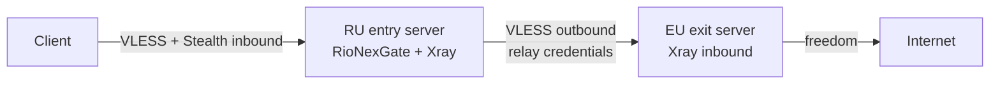

**[English](multihop.md)** | Русский

# Мульти-хоп цепочки (RU entry → EU exit)

RioNexGate поддерживает цепочки прокси **entry → exit**: клиенты подключаются только к **входному** узлу (например, сервер в России), а в Интернет трафик выходит с **выходного** узла (например, сервер в ЕС). Панель на entry-сервере генерирует Xray outbound, которые ретранслируют трафик пользователей на зарегистрированные exit-узлы.

Это полное руководство по проектированию, развёртыванию, эксплуатации и устранению неполадок мульти-хоп топологий. Основано на реализации в `backend/internal/core/multihop.go`, `backend/internal/core/templates/xray.json.tmpl`, `backend/internal/models/node.go` и UI страниц Nodes / User chain.

> **Область применения:** генерация outbound и routing для цепочек реализована для **Xray-core** (`core.type: xray`). Шаблон sing-box **не** создаёт chain outbound — для мульти-хопа используйте Xray на entry-сервере. См. [Ограничения](#ограничения).

---

## Содержание

1. [Глоссарий](#глоссарий)
2. [Архитектура](#архитектура)
3. [Сеть и матрица файрвола](#сеть-и-матрица-файрвола)
4. [Топология развёртывания](#топология-развёртывания)
5. [Полное пошаговое развёртывание](#полное-пошаговое-развёртывание)
6. [Справочник credentials JSON](#справочник-credentials-json)
7. [Анатомия Xray-конфига](#анатомия-xray-конфига)
8. [Руководство по UI панели (`/nodes`)](#руководство-по-ui-панели-nodes)
9. [Назначение цепочки пользователю](#назначение-цепочки-пользователю)
10. [Подписка и поведение клиента](#подписка-и-поведение-клиента)
11. [Stealth и мульти-хоп вместе](#stealth-и-мульти-хоп-вместе)
12. [Примеры конфигурации](#примеры-конфигурации)
13. [Справочник API](#справочник-api)
14. [Процедуры проверки](#процедуры-проверки)
15. [Устранение неполадок](#устранение-неполадок)
16. [Заметки по безопасности](#заметки-по-безопасности)
17. [Продакшен-чеклист](#продакшен-чеклист)
18. [FAQ](#faq)
19. [Ограничения](#ограничения)
20. [См. также](#см-также)

---

## Глоссарий

| Term | Definition |
|------|------------|
| **Entry node** | The client-facing hop. Users connect here with VLESS (optionally Reality / XHTTP / Vision). Stored in the `nodes` table with `role: entry`. Client links, QR codes, and subscriptions always resolve to the entry `address:port`. |
| **Exit node** | The Internet egress hop. The entry server's Xray opens a VLESS outbound to this host using relay credentials stored in the exit node record. Stored with `role: exit`. Never exposed to clients. |
| **Relay user** | A dedicated VLESS user on the EU exit inbound whose UUID is copied into the exit node's `credentials.uuid` on the RU panel. Not the same as end-user UUIDs. |
| **Chain tag** | Xray outbound tag for the chained freedom outbound: `exit-<name>-chain`, where `<name>` is the unique exit node `name` field. Routing rules send user traffic to this tag. |
| **Outbound tag** | The direct VLESS outbound tag to the exit: `exit-<name>` (from `Node.OutboundTag()`). The `-chain` outbound proxies through this tag via `proxySettings`. |
| **`local_role`** | Field in `core.multihop` (`entry` or other). Only `enabled: true` **and** `local_role: entry` triggers `BuildMultihopData` and chain generation (`MultihopConfig.IsEntryNode()`). |
| **Auto resolution** | When a user has no explicit `entry_node_id` / `exit_node_id`, the panel picks the **lowest `priority`** among **active** nodes of that role (`ORDER BY priority ASC, id ASC`). |
| **`ResolveClientEndpoint`** | Go function that returns `{Host, Port}` for client-facing output. Uses the resolved entry node if present; otherwise falls back to `core.public_host` and `core.listen_port`. Exit nodes are never passed in. |

---

## Архитектура

### Общая схема



### Последовательность подключения


ASCII-эквивалент:

```
  Client
    |
    |  VLESS (+ Reality / XHTTP / Vision per core.stealth)
    v
  +---------------------------+
  | RU entry server           |
  | RioNexGate panel + Xray   |
  | - user inbounds           |
  | - multihop outbounds      |
  +---------------------------+
    |
    |  VLESS to exit node (stored credentials)
    v
  +---------------------------+
  | EU exit server            |
  | Xray inbound (relay user) |
  +---------------------------+
    |
    v
  Internet (EU egress IP)
```

**Что видит клиент:** ссылки подписки, QR-коды и конфиги RioNexTunnel указывают только на **entry** host/port (`ResolveClientEndpoint`). Exit-узлы клиентам не публикуются.

**Что содержит Xray-конфиг на entry:** для каждого активного exit-узла, используемого хотя бы одним активным пользователем, генератор добавляет:

1. **VLESS outbound** на `address:port` exit с credentials из записи узла (тег: `exit-<name>`).
2. **freedom outbound** с `proxySettings`, цепляющимся к VLESS outbound (тег: `exit-<name>-chain`).
3. **Правило routing**, сопоставляющее email пользователей с тегом chained outbound (`exit-<name>-chain`).

See [`backend/internal/core/templates/xray.json.tmpl`](../backend/internal/core/templates/xray.json.tmpl) and [`multihop.go`](../backend/internal/core/multihop.go).

---

## Сеть и матрица файрвола

### Справочник портов

| Порт | Протокол | Направление | Сервис | Примечания |
|------|----------|-----------|---------|-------|
| **443** | TCP | Client → RU | XHTTP + Reality inbound (typical) | Основной stealth-порт при `core.stealth.xhttp.enabled: true` |
| **8443** | TCP | Client → RU | Vision + Reality inbound (typical) | Дополнительный stealth-порт при `core.stealth.vision.enabled: true` |
| **2053** | TCP | Client → RU | VLESS + TLS inbound (optional) | При `core.stealth.tls.enabled: true`; поддерживает фрагментацию |
| **8888** | TCP | Admin → RU | RioNexGate panel (nginx) | Меняется через `HTTP_PORT` в `.env`; в продакшене HTTPS |
| **8080** | TCP | Local / debug | Backend API direct | Не нужен снаружи при проксировании nginx `/api` |
| **8443** (example) | TCP | RU → EU | Exit relay inbound | Совпадает с `port` exit-узла и EU inbound; Vision типичен |
| **443** (alternate) | TCP | RU → EU | Exit relay inbound | Если EU слушает 443 вместо 8443 |
| **10085** | TCP | Docker internal | Xray stats API | `core.xray.api_address`; не для клиентов |

### Минимальные правила файрвола

| Правило | Источник | Назначение | Порт | Действие |
|------|--------|-------------|------|--------|
| Доступ клиентов | Internet / user networks | RU public IP | 443, 8443 (+ TLS port if used) | ALLOW |
| Межузловой релей | RU private/public IP | EU public IP | Exit node port (e.g. 8443) | ALLOW |
| Админ панели | Your admin IP(s) | RU public IP | 8888 or HTTPS | ALLOW (ограничить источник) |
| EU-панель (опционально) | Your admin IP(s) | EU public IP | 8888 | ALLOW только если RioNexGate на EU |
| Блокировка клиентов на EU | Internet | EU public IP | 443, 8443 | DENY если EU только релей (рекомендуется) |

### Проверка связности

С **RU entry-сервера**:

```bash
# TCP to EU relay port (replace host/port)
nc -zv eu.example.com 8443

# DNS resolution
dig +short eu.example.com

# Latency (health check uses 5s dial timeout)
time nc -zv eu.example.com 8443
```

С **рабочей станции клиента**:

```bash
# Entry stealth ports
nc -zv ru.example.com 443
nc -zv ru.example.com 8443
```

---

## Топология развёртывания

| Сервер | Роль | Панель RioNexGate | `core.multihop` | Назначение |
|--------|------|------------------|-----------------|---------|
| RU | Entry | **Да** (основная) | `enabled: true`, `local_role: entry` | Inbound для клиентов, управление цепочками, outbound в EU |
| EU | Exit | Опционально (локальный админ) | `enabled: false` (или не указывать) | Inbound-реле для entry; выход в Интернет |

**Панель управления находится на entry-сервере.** Exit servers only need a matching Xray inbound for the relay credentials you store in the exit node record. Running RioNexGate on the EU host is convenient for user/credential management but not required for the chain itself.

### Когда регистрировать entry-узел

Запись entry-узла **опциональна**, но рекомендуется когда:

- `core.public_host` differs from the hostname clients should use (CDN, anycast, multiple RU IPs).
- You run multiple entry servers and want per-user entry assignment.
- You want the `/nodes` topology diagram to show the real client-facing endpoint.

Без entry-узла `ResolveClientEndpoint` использует `core.public_host` + `core.listen_port`.

---

## Полное пошаговое развёртывание

Этот раздел описывает полное развёртывание RU entry → EU exit от пустых серверов до проверенного egress в EU.

### Фаза A — RU entry-сервер

#### A.1 Подготовка ОС

1. Создайте Linux VPS (Ubuntu 22.04/24.04 or Debian 12 recommended) in Russia (or your entry region).
2. Задайте hostname и часовой пояс:

```bash
sudo hostnamectl set-hostname ru-entry
sudo timedatectl set-timezone Europe/Moscow
```

3. Обновите пакеты и установите зависимости:

```bash
sudo apt update && sudo apt upgrade -y
sudo apt install -y git make curl jq ufw
```

4. Настройте UFW (укажите IP админа):

```bash
sudo ufw allow 22/tcp
sudo ufw allow 443/tcp
sudo ufw allow 8443/tcp
sudo ufw allow 8888/tcp    # restrict to admin IP in production
sudo ufw enable
```

#### A.2 Установка Docker

```bash
curl -fsSL https://get.docker.com | sudo sh
sudo usermod -aG docker "$USER"
# Перелогиньтесь для применения группы docker
docker compose version
```

#### A.3 Клонирование RioNexGate и инициализация

```bash
git clone https://github.com/RioTwWks/RioNexGate.git
cd RioNexGate
make init
```

`make init` создаёт `backend/config.yaml`, `.env` и каталоги `data/`.

#### A.4 Генерация пары Reality (RU — для клиентов)

На RU-хосте или любой машине с Xray:

```bash
docker run --rm ghcr.io/xtls/xray-core:latest x25519
```

Пример вывода:

```
Private key: aB3dEf9GhIjKlMnOpQrStUvWxYz0123456789AbCdEfGh
Public key:  XyZ9wVuTsRqPoNmLkJiHgFeDcBa9876543210ZyXwVuTs
```

Скопируйте **Private key** → `core.stealth.reality.private_key`  
Скопируйте **Public key** → `core.stealth.reality.public_key` (нужен клиентам в ссылках; не секрет)

#### A.5 Настройка RU `backend/config.yaml` (построчно)

Отредактируйте `backend/config.yaml`. Ниже — аннотированный продакшен-конфиг entry. Добавьте блок `multihop` — в `config.example.yaml` его нет по умолчанию, но для цепочек он обязателен.

```yaml
server:
  port: 8080
  api_key: "REPLACE_WITH_LONG_RANDOM_KEY"   # panel login; rotate from default

database:
  path: "./data/rionexgate.db"

core:
  type: xray                              # REQUIRED for multi-hop chain generation
  listen_port: 443                        # fallback port when no entry node port set
  public_host: "ru.example.com"           # fallback host in client links
  stats_poll_seconds: 60

  multihop:
    enabled: true                         # turn on BuildMultihopData
    local_role: entry                     # only "entry" generates chain outbounds

  xray:
    config_path: "./data/xray/config.json"
    binary_path: "/usr/local/bin/xray"
    api_address: "host.docker.internal:10085"

  stealth:
    enabled: true
    fingerprint: firefox                  # firefox or edge; avoid chrome/safari per stealth docs
    reality:
      dest: "www.microsoft.com:443"       # believable TLS front target
      server_names:
        - "www.microsoft.com"
      private_key: "RU_REALITY_PRIVATE_KEY_FROM_x25519"
      public_key: "RU_REALITY_PUBLIC_KEY_FROM_x25519"
      short_ids:
        - "a1b2c3d4"
      show: false
      xver: 0
    xhttp:
      enabled: true
      port: 443                           # client primary port
      path: "/api/v1/data"
      mode: stream-one                    # do not use auto — known client bugs
      tag: vless-xhttp-reality
    vision:
      enabled: true
      port: 8443                          # client secondary port
      tag: vless-vision-reality
    tls:
      enabled: false                      # optional; enable only if you need TLS+fragmentation inbound
    fragmentation:
      enabled: false
    awg:
      enabled: false                      # incompatible with multi-hop chains; see Limitations

telegram:
  bot_token: ""
  admin_ids: []

limits:
  default_traffic_gb: 50
  default_expire_days: 30
```

Значения полей:

| Поле | Назначение |
|-------|---------|
| `core.type: xray` | Only Xray template emits multihop outbounds |
| `core.multihop.enabled` | Master switch for chain generation |
| `core.multihop.local_role: entry` | This host is the chain orchestrator |
| `core.public_host` | Default entry hostname when no entry node is resolved |
| `core.stealth.xhttp.port` | Port clients use for XHTTP profile (usually 443) |
| `core.stealth.vision.port` | Port clients use for Vision profile (usually 8443) |
| `core.stealth.reality.*` | Client-facing Reality parameters (separate from EU hop keys) |

#### A.6 Запуск RioNexGate и Xray

```bash
make up          # detached: backend, frontend, nginx
make dev-cores   # xray-core container (profile cores)
```

Откройте панель: `http://ru.example.com:8888` → введите API key из `server.api_key`.

#### A.7 Проверка RU-стека перед добавлением EU

```bash
curl -s -H "X-API-Key: YOUR_KEY" http://localhost:8888/api/health | jq .
docker compose exec xray-core xray run -test -c /etc/xray/config.json
```

---

### Фаза B — EU exit-сервер

You have two supported options. Both require a VLESS inbound that accepts the relay UUID from RU.

#### Вариант B1 — Полный RioNexGate на EU (рекомендуется)

**B1.1** Repeat A.1–A.3 on the EU VPS.

**B1.2** Generate a **separate** Reality keypair for the EU hop (do not reuse RU keys):

```bash
docker run --rm ghcr.io/xtls/xray-core:latest x25519
```

**B1.3** Configure EU `backend/config.yaml`:

```yaml
server:
  port: 8080
  api_key: "EU_ADMIN_KEY_DIFFERENT_FROM_RU"

database:
  path: "./data/rionexgate.db"

core:
  type: xray
  listen_port: 443
  public_host: "eu.example.com"
  stats_poll_seconds: 60

  multihop:
    enabled: false                        # exit host does not generate chains

  xray:
    config_path: "./data/xray/config.json"
    binary_path: "/usr/local/bin/xray"
    api_address: "host.docker.internal:10085"

  stealth:
    enabled: true
    fingerprint: firefox
    reality:
      dest: "www.cloudflare.com:443"
      server_names:
        - "www.cloudflare.com"
      private_key: "EU_REALITY_PRIVATE_KEY"
      public_key: "EU_REALITY_PUBLIC_KEY"
      short_ids:
        - "b2c3d4e5"
      show: false
      xver: 0
    xhttp:
      enabled: false                      # hop typically uses Vision on 8443
    vision:
      enabled: true
      port: 8443                          # RU will connect here
      tag: vless-vision-reality
    tls:
      enabled: false
    awg:
      enabled: false

limits:
  default_traffic_gb: 9999
  default_expire_days: 3650
```

**B1.4** Start services:

```bash
make up
make dev-cores
```

**B1.5** Create relay user in EU panel:

1. Open `http://eu.example.com:8888` (firewall-restricted).
2. **Users** → **Add user**.
3. Email: `relay@eu.internal` (any unique email).
4. Copy the user's **UUID** from the user detail page — this becomes `credentials.uuid` on RU.

**B1.6** Record EU hop parameters for the RU exit node:

| Поле exit-узла на RU | Источник на EU |
|--------------------|-----------|
| `address` | `eu.example.com` (must be reachable from RU) |
| `port` | `8443` (`core.stealth.vision.port`) |
| `credentials.uuid` | Relay user UUID |
| `credentials.public_key` | `core.stealth.reality.public_key` |
| `credentials.short_id` | First entry in `core.stealth.reality.short_ids` |
| `credentials.flow` | `xtls-rprx-vision` |
| `credentials.security` | `reality` |
| `credentials.network` | `tcp` |

#### Вариант B2 — Standalone Xray на EU (минимальный)

Use when you do not want a panel on EU. Create `/etc/xray/config.json`:

```json
{
  "log": {
    "loglevel": "warning"
  },
  "inbounds": [
    {
      "tag": "relay-vision",
      "listen": "0.0.0.0",
      "port": 8443,
      "protocol": "vless",
      "settings": {
        "clients": [
          {
            "id": "550e8400-e29b-41d4-a716-446655440000",
            "email": "relay@eu.internal",
            "flow": "xtls-rprx-vision",
            "level": 0
          }
        ],
        "decryption": "none"
      },
      "streamSettings": {
        "network": "tcp",
        "security": "reality",
        "realitySettings": {
          "show": false,
          "dest": "www.cloudflare.com:443",
          "xver": 0,
          "serverNames": ["www.cloudflare.com"],
          "privateKey": "EU_REALITY_PRIVATE_KEY",
          "shortIds": ["b2c3d4e5"]
        }
      },
      "sniffing": {
        "enabled": true,
        "destOverride": ["http", "tls", "quic"]
      }
    }
  ],
  "outbounds": [
    {
      "protocol": "freedom",
      "tag": "direct"
    }
  ]
}
```

Generate keys with `xray x25519`, replace `privateKey`, and use the matching **public** key and `shortIds` in the RU exit node credentials.

Start and test:

```bash
xray run -test -c /etc/xray/config.json
xray run -c /etc/xray/config.json
sudo ufw allow 8443/tcp
```

---

### Фаза C — Регистрация узлов на RU-панели

Перейдите на **`/nodes`** в RU-панели (боковое меню: **Nodes** / **Multi-hop nodes**).

#### C.1 Создание entry-узла (рекомендуется)

1. Нажмите **Add node**.
2. Заполните форму:
   - **Name:** `entry-ru` (slug; used in UI only for entry nodes)
   - **Role:** `Entry`
   - **Address:** `ru.example.com` (what clients connect to)
   - **Port:** `443` (primary XHTTP port; or `8443` if you only use Vision)
   - **Region:** `RU`
   - **Priority:** `10` (lower = preferred in auto selection)
   - **Active:** checked
3. Нажмите **Create**.

Диаграмма топологии обновится и покажет `entry-ru` в блоке Entry.

#### C.2 Создание exit-узла (обязательно)

1. Нажмите **Add node**.
2. Заполните форму:
   - **Name:** `exit-eu` (becomes outbound tag `exit-exit-eu`)
   - **Role:** `Exit`
   - **Address:** `eu.example.com`
   - **Port:** `8443`
   - **Region:** `EU`
   - **Priority:** `10`
   - **Protocol:** `vless`
   - **Active:** checked
3. Expand **Credentials** and enter UUID, Public key, Short ID (or paste full JSON via API — see below).
4. Click **Create**.

For full credentials (flow, network, path), use the API — the UI form exposes UUID, public key, and short ID only; additional fields require `POST /api/nodes` or `PUT /api/nodes/{id}`.

#### C.3 Health-check

1. В таблице **Exit nodes** нажмите **Health check** у `exit-eu`.
2. Ожидайте зелёный **TCP OK (N мс)**, когда RU достигает `eu.example.com:8443`.
3. Если красный — см. [Устранение неполадок](#устранение-неполадок).

---

### Фаза D — Тестовый пользователь и назначение цепочки

#### D.1 Создание пользователя

1. **Users** → **Add user**.
2. Email: `test@example.com`.
3. Запишите URL подписки на странице пользователя.

#### D.2 Назначение цепочки

1. Откройте пользователя **test@example.com**.
2. Прокрутите до секции **Multi-hop chain**.
3. Превью топологии: Client → Entry → Exit → Internet.
4. **Entry node:** выберите `entry-ru` или оставьте **Auto entry**.
5. **Exit node:** выберите `exit-eu` или оставьте **Auto exit**.
6. Нажмите **Save chain**.

Backend вызывает `PUT /api/users/{id}/chain`, проверяет роли, выполняет `core.Reload()` и перегенерирует `data/xray/config.json`.

#### D.3 Проверка egress IP в EU

Подключите клиента по ссылке подписки (только entry host). Затем:

```bash
curl -x socks5h://127.0.0.1:10808 https://ifconfig.me
# or through your client's HTTP proxy
curl https://ifconfig.me
```

Возвращённый IP должен быть **публичным IP EU-сервера**, не RU.

---

## Справочник credentials JSON

Поле `credentials` exit-узла — **JSON-строка** в БД. Парсится `models.ParseNodeCredentials()` и рендерится в шаблон Xray outbound.

### Пример 1 — Vision + Reality (рекомендуется для hop RU→EU)

```json
{
  "uuid": "550e8400-e29b-41d4-a716-446655440000",
  "encryption": "none",
  "flow": "xtls-rprx-vision",
  "security": "reality",
  "public_key": "XyZ9wVuTsRqPoNmLkJiHgFeDcBa9876543210ZyXwVuTs",
  "short_id": "b2c3d4e5",
  "fingerprint": "firefox",
  "network": "tcp",
  "sni": "www.cloudflare.com"
}
```

| Поле | Значение | Соответствие в сгенерированном outbound |
|-------|-------|-------------------------------|
| `uuid` | Relay user UUID on EU | `settings.vnext[].users[].id` |
| `flow` | `xtls-rprx-vision` | `settings.vnext[].users[].flow` |
| `security` | `reality` | `streamSettings.security` |
| `public_key` | EU Reality public key | `realitySettings.publicKey` |
| `short_id` | EU short ID | `realitySettings.shortId` |
| `fingerprint` | `firefox` | `realitySettings.fingerprint` |
| `network` | `tcp` | `streamSettings.network` |
| `sni` | Optional; defaults to exit `address` | `realitySettings.serverName` |

### Пример 2 — XHTTP + Reality (hop через XHTTP)

```json
{
  "uuid": "660e8400-e29b-41d4-a716-446655440001",
  "encryption": "none",
  "security": "reality",
  "public_key": "AbCdEfGhIjKlMnOpQrStUvWxYz0123456789AbCdEfGh",
  "short_id": "c3d4e5f6",
  "fingerprint": "firefox",
  "network": "xhttp",
  "path": "/api/v1/relay",
  "mode": "stream-one",
  "sni": "www.cloudflare.com"
}
```

EU inbound должен открывать XHTTP с тем же `path` и `mode`. Для XHTTP поле `flow` не нужно.

### Пример 3 — VLESS + TLS без Reality на hop

```json
{
  "uuid": "770e8400-e29b-41d4-a716-446655440002",
  "encryption": "none",
  "security": "tls",
  "network": "tcp",
  "sni": "eu.example.com",
  "fingerprint": "firefox"
}
```

Нужен валидный TLS-сертификат на EU inbound, совпадающий с `sni`. Реже для межузловых hop, чем Reality.

### Полный справочник полей

| Поле | Обязательно | По умолчанию | Описание |
|-------|----------|---------|-------------|
| `uuid` | Yes (VLESS) | — | Relay user UUID on the exit server |
| `encryption` | No | `none` | VLESS encryption (`EncryptionOrDefault()`) |
| `flow` | For Vision | — | e.g. `xtls-rprx-vision` |
| `security` | No | `none` | `reality`, `tls`, or `none` (`SecurityOrDefault()`) |
| `public_key` | For Reality | — | Exit inbound Reality public key (`pbk`) |
| `short_id` | For Reality | — | Exit inbound short ID |
| `sni` | No | exit node `address` | TLS/Reality SNI in outbound |
| `fingerprint` | No | `firefox` | uTLS fingerprint (`FingerprintOrDefault()`) |
| `network` | No | `tcp` | `tcp` or `xhttp` (`NetworkOrDefault()`) |
| `path` | For XHTTP | — | XHTTP path (must match EU inbound) |
| `mode` | For XHTTP | — | XHTTP mode, typically `stream-one` |

Источник схемы: [`backend/internal/models/node.go`](../backend/internal/models/node.go).

---

## Анатомия Xray-конфига

When `BuildMultihopData` returns `Enabled: true`, the xray template appends outbounds and a routing section.

### Логика генерации

From `multihop.go`:

1. `BuildMultihopData` runs only if `multihop.IsEntryNode()` and there is at least one exit node in the database.
2. For each **active user** with a resolvable exit (`ResolveUserExitNode`), an outbound entry is created keyed by exit node ID.
3. Outbound tag = `exit-<name>` via `Node.OutboundTag()`.
4. User emails sharing the same exit are grouped into one routing rule targeting `exit-<name>-chain`.

### Фрагмент шаблона — VLESS outbound на exit

From `xray.json.tmpl` (lines 169–201):

```json
{
  "protocol": "vless",
  "tag": "exit-exit-eu",
  "settings": {
    "vnext": [{
      "address": "eu.example.com",
      "port": 8443,
      "users": [{
        "id": "550e8400-e29b-41d4-a716-446655440000",
        "encryption": "none",
        "flow": "xtls-rprx-vision"
      }]
    }]
  },
  "streamSettings": {
    "network": "tcp",
    "security": "reality",
    "realitySettings": {
      "serverName": "eu.example.com",
      "fingerprint": "firefox",
      "publicKey": "EU_PUBLIC_KEY",
      "shortId": "b2c3d4e5"
    }
  }
}
```

### Фрагмент шаблона — chained freedom outbound

```json
{
  "protocol": "freedom",
  "tag": "exit-exit-eu-chain",
  "settings": {
    "domainStrategy": "AsIs"
  },
  "proxySettings": {
    "tag": "exit-exit-eu"
  }
}
```

### Фрагмент шаблона — routing по пользователям

```json
"routing": {
  "domainStrategy": "AsIs",
  "rules": [{
    "type": "field",
    "user": ["test@example.com"],
    "outboundTag": "exit-exit-eu-chain"
  }]
}
```

**Важно:** пользователи без разрешённого exit **не** попадают в multihop routing и используют outbound `direct` (egress RU).

### Просмотр живого конфига

```bash
# Pretty-print outbounds and routing
jq '.outbounds[] | select(.tag | startswith("exit-"))' data/xray/config.json
jq '.routing' data/xray/config.json

# Validate syntax
docker compose exec xray-core xray run -test -c /etc/xray/config.json
```

---

## Руководство по UI панели (`/nodes`)

URL: `http://<ru-host>:8888/nodes`

### Структура страницы

| Секция | Описание |
|---------|-------------|
| **Header** | Title "Multi-hop nodes" and **Add node** button |
| **Topology** | `ChainTopology` component: Client → Entry → Exit → Internet. Shows lowest-priority **active** entry/exit when in auto mode |
| **Entry nodes table** | All nodes with `role: entry` |
| **Exit nodes table** | All nodes with `role: exit` |

### Колонки и действия таблицы

| Колонка / действие | Значение |
|-----------------|---------|
| Name | Unique slug; exit names determine outbound tags |
| Address:Port | Target for health check and (exit) outbound dial |
| Region | Informational label (e.g. RU, EU) |
| Active / Inactive | Toggle; inactive nodes skipped in `ResolveUserEntryNode` / `ResolveUserExitNode` |
| Health check | `GET /api/nodes/{id}/health` — TCP dial, 5s timeout |
| Edit | Opens `NodeForm` modal |
| Delete | Removes node; clears `entry_node_id` / `exit_node_id` on affected users |

### Интерпретация health-check

| Результат | Значение | Следующий шаг |
|--------|---------|-----------|
| `TCP OK (42ms)` | Port open from panel/backend host | Does **not** prove VLESS/Reality works — test with live traffic |
| `connection refused` | Nothing listening on port | Start EU Xray; verify port in config |
| `i/o timeout` | Firewall or routing block | Open EU firewall for RU source IP |
| `address is empty` | Node record incomplete | Edit node, set address |

### Active и inactive

- **Inactive entry:** skipped for auto resolution; explicit `entry_node_id` pointing to inactive node falls back to `GetBestEntryNode()`.
- **Inactive exit:** skipped for auto resolution; users with explicit inactive exit fall back to `GetBestExitNode()`; if none active, no multihop routing for that user.

### Зачем создавать entry-узел?

Entry nodes decouple `core.public_host` from the client-visible endpoint. Use them when:

- DNS points to a load balancer but links should show a specific hostname.
- You assign different users to different entry IPs in the same panel.

---

## Назначение цепочки пользователю

### Рабочий процесс в UI (`/users/:id`)

1. Open user detail page.
2. **Multi-hop chain** section (`UserChainSection`):
   - Mini topology diagram updates as you change selects.
   - **Auto entry** / **Auto exit** — empty value → lowest priority active node.
   - **Save chain** → `PUT /api/users/{id}/chain`.

### Порядок разрешения (код)

`ResolveUserExitNode` (`db/nodes.go`):

1. If `user.exit_node_id` set → load node; return if active and role `exit`.
2. Else → `GetBestExitNode()` (lowest priority active exit).

Same pattern for entry via `ResolveUserEntryNode`.

### API — привязка цепочки

```bash
curl -s -X PUT http://localhost:8888/api/users/1/chain \
  -H "X-API-Key: YOUR_KEY" \
  -H "Content-Type: application/json" \
  -d '{
    "entry_node_id": 1,
    "exit_node_id": 2
  }'
```

Пример ответа:

```json
{
  "id": 1,
  "uuid": "a1b2c3d4-e5f6-7890-abcd-ef1234567890",
  "email": "test@example.com",
  "traffic_gb": 50,
  "used_gb": 0,
  "expires_at": "2026-10-08T08:00:00Z",
  "active": true,
  "entry_node_id": 1,
  "exit_node_id": 2,
  "created_at": "2026-09-08T08:00:00Z",
  "subscription_token": "abc123...",
  "subscription_url": "http://ru.example.com:8888/api/subscription/abc123..."
}
```

### API — авто-режим (сброс явных привязок)

```bash
curl -s -X PUT http://localhost:8888/api/users/1/chain \
  -H "X-API-Key: YOUR_KEY" \
  -H "Content-Type: application/json" \
  -d '{"clear": true}'
```

### API — через обновление пользователя

```bash
curl -s -X PUT http://localhost:8888/api/users/1 \
  -H "X-API-Key: YOUR_KEY" \
  -H "Content-Type: application/json" \
  -d '{
    "entry_node_id": 1,
    "exit_node_id": 2
  }'
```

Set `"clear_chain": true` to null both node IDs.

### Ответы с ошибками

| HTTP | Тело | Причина |
|------|------|-------|
| 400 | `invalid entry node` | ID missing, wrong role, or not role `entry` |
| 400 | `invalid exit node` | ID missing, wrong role, or not role `exit` |
| 404 | `record not found` | User ID does not exist |

---

## Подписка и поведение клиента

### Что содержат ссылки

`BuildSubscriptionLinks` calls `ResolveClientEndpoint` then `GetClientLinkProfiles`:

- Host = entry node address **or** `core.public_host`
- Port = entry node port **or** `core.listen_port`
- User UUID = end-user UUID (not relay UUID)
- Stealth params = **RU entry** Reality keys, paths, modes

Exit hostname, relay UUID, and EU Reality keys are **never** included.

Example XHTTP link shape:

```
vless://USER_UUID@ru.example.com:443?encryption=none&type=xhttp&security=reality&sni=www.microsoft.com&fp=firefox&pbk=RU_PUBLIC_KEY&sid=a1b2c3d4&path=%2Fapi%2Fv1%2Fdata&mode=stream-one#test%40example.com-xhttp
```

### Endpoint подписки

```bash
curl -s "http://ru.example.com:8888/api/subscription/TOKEN" | base64 -d
```

Returns newline-separated links. Decode and verify host is `ru.example.com`, not `eu.example.com`.

### RioNexTunnel / `GET /api/client/config`

`BuildClientConfig` sets:

```json
{
  "config_hash": "...",
  "servers": [{
    "protocol": "vless",
    "host": "ru.example.com",
    "port": 443,
    "id": "USER_UUID"
  }],
  "profiles": [ /* stealth profiles with entry host/port */ ],
  "inbounds": { "socks5": { "port": 10808, "auth": "none" } },
  "dns": { "servers": ["1.1.1.1", "8.8.8.8"] }
}
```

RioNexTunnel connects to **entry only**. Multi-hop is transparent — chaining happens inside RU Xray after the client connects.

### Поведение `ResolveClientEndpoint`

```go
func ResolveClientEndpoint(publicHost string, listenPort int, user models.User, entry *models.Node) ClientEndpoint {
    if entry != nil {
        port := entry.Port
        if port <= 0 {
            port = listenPort
        }
        return ClientEndpoint{Host: entry.Address, Port: port}
    }
    return ClientEndpoint{Host: publicHost, Port: listenPort}
}
```

The `user` parameter is reserved for future per-user endpoint logic; currently unused.

---

## Stealth и мульти-хоп вместе

Typical production stack:

| Участок | Транспорт | Порт | Назначение |
|-----|-----------|------|---------|
| Клиент → RU | VLESS + Reality + XHTTP (`stream-one`) | 443 | Защита от DPI на первом hop |
| RU → EU | VLESS + Reality + Vision | 8443 | Эффективный межузловой релей |

### Чеклист конфигурации (RU entry)

- [ ] `core.stealth.enabled: true`
- [ ] RU Reality keys generated (`xray x25519`) — **different** from EU hop keys
- [ ] `core.stealth.xhttp.enabled: true`, `mode: stream-one`
- [ ] `core.stealth.vision.enabled: true` if offering Vision profile to clients
- [ ] `core.multihop.enabled: true`, `local_role: entry`
- [ ] Exit node credentials match EU inbound (relay UUID, EU public key, short ID, flow)

### Чеклист конфигурации (EU exit)

- [ ] Separate Reality keypair from RU
- [ ] Vision inbound on port matching exit node `port`
- [ ] Relay user UUID active
- [ ] `core.multihop.enabled: false`
- [ ] Firewall allows **only RU IP** on relay port (recommended)

### Что видит DPI

- **Клиент ↔ RU:** трафик Reality, имитирующий TLS к CDN.
- **RU ↔ EU:** серверный VLESS (часто тоже Reality) — не виден клиентскому DPI.
- **Сайты:** IP EU-сервера как источник.

---

## Примеры конфигурации

### RU entry — full `backend/config.yaml`

См. [Фаза A.5](#a5-настройка-ru-backendconfigyaml-построчно) for the annotated example.

### EU exit — full `backend/config.yaml`

См. [Вариант B1](#вариант-b1--полный-rionexgate-на-eu-рекомендуется).

### Добавление multihop в `config.example.yaml`

В стандартном примере multihop отсутствует. Добавьте под `core:`:

```yaml
  multihop:
    enabled: true
    local_role: entry    # только на RU
```

---

## Справочник API

Базовый URL: `http://localhost:8888/api` (nginx) or `http://localhost:8080/api` (backend).  
Заголовок авторизации: `X-API-Key: <server.api_key>`

| Метод | Endpoint | Описание |
|--------|----------|-------------|
| GET | `/nodes` | List all nodes (ordered by priority) |
| POST | `/nodes` | Create node |
| GET | `/nodes/{id}` | Get node |
| PUT | `/nodes/{id}` | Update node |
| DELETE | `/nodes/{id}` | Delete node; clear user chain refs |
| GET | `/nodes/{id}/health` | TCP health check |
| PUT | `/users/{id}/chain` | Set or clear user chain |
| GET | `/users/{id}` | User detail with `entry_node_id`, `exit_node_id` |
| GET | `/subscription/{token}` | Base64 subscription links |
| GET | `/client/config?token=...` | RioNexTunnel JSON config |

### List nodes

```bash
curl -s -H "X-API-Key: YOUR_KEY" http://localhost:8888/api/nodes | jq .
```

### Create exit node (full credentials)

```bash
curl -s -X POST http://localhost:8888/api/nodes \
  -H "X-API-Key: YOUR_KEY" \
  -H "Content-Type: application/json" \
  -d '{
    "name": "exit-eu",
    "address": "eu.example.com",
    "port": 8443,
    "role": "exit",
    "protocol": "vless",
    "region": "EU",
    "priority": 10,
    "active": true,
    "credentials": "{\"uuid\":\"550e8400-e29b-41d4-a716-446655440000\",\"flow\":\"xtls-rprx-vision\",\"security\":\"reality\",\"public_key\":\"EU_PUBLIC_KEY\",\"short_id\":\"b2c3d4e5\",\"fingerprint\":\"firefox\",\"network\":\"tcp\"}"
  }'
```

### Create entry node

```bash
curl -s -X POST http://localhost:8888/api/nodes \
  -H "X-API-Key: YOUR_KEY" \
  -H "Content-Type: application/json" \
  -d '{
    "name": "entry-ru",
    "address": "ru.example.com",
    "port": 443,
    "role": "entry",
    "region": "RU",
    "priority": 10,
    "active": true
  }'
```

OpenAPI: `GET /api/docs` — search for `Nodes` and `UpdateUserChain`.

---

## Процедуры проверки

### 1. Проверка health-check в панели

Nodes → **Health check** on exit node. Expect `TCP OK`.

### 2. Содержимое подписки

```bash
TOKEN="user_subscription_token"
curl -s "http://localhost:8888/api/subscription/$TOKEN" | base64 -d | head -5
```

Verify: host is entry; no `eu.example.com`; user UUID present.

### 3. Тест Xray-конфига

```bash
docker compose exec xray-core xray run -test -c /etc/xray/config.json
```

Expect: `Configuration OK`.

### 4. Наличие тегов outbound

```bash
grep -E 'exit-exit-eu|exit-exit-eu-chain' data/xray/config.json
```

### 5. Живой egress IP

Through connected client:

```bash
curl https://ifconfig.me
curl https://ipinfo.io/country
```

Should show EU country/IP.

### 6. Лог доступа Xray (отладка)

Temporarily set `"loglevel": "debug"` in generated config (or enable via template edit), reload, watch inter-node connection:

```bash
docker compose logs -f xray-core
```

### 7. Состояние цепочки через API

```bash
curl -s -H "X-API-Key: YOUR_KEY" http://localhost:8888/api/users/1 | jq '{email, entry_node_id, exit_node_id}'
```

---

## Устранение неполадок

| # | Симптом | Вероятная причина | Диагностика | Решение |
|---|---------|--------------|-----------|-----|
| 1 | Traffic exits from RU IP | No exit assigned; multihop off; no active exit | `jq '.routing' data/xray/config.json` empty? | Enable multihop; create exit; assign user |
| 2 | No `exit-*` outbounds in config | `core.type: sing-box` | Check `core.type` | Switch to `xray` |
| 3 | No outbounds despite xray | No user resolves to exit | List users' `exit_node_id`; check active exits | Assign exit; activate node |
| 4 | `invalid exit node` API error | Wrong role or bad ID | `GET /api/nodes/{id}` | Set `role: exit` |
| 5 | `invalid entry node` API error | Node is exit role | Check node role | Create entry node |
| 6 | RU cannot reach EU | Firewall | `nc -zv eu.example.com 8443` from RU | Open port; check security groups |
| 7 | Health OK, VLESS fails | Credentials mismatch | Compare JSON to EU inbound | Fix uuid, pbk, sid, flow |
| 8 | Vision flow error | Missing `flow` on hop | Check outbound in config.json | Add `flow: xtls-rprx-vision` |
| 9 | XHTTP hop fails | path/mode mismatch | Compare path/mode EU vs credentials | Align both sides |
| 10 | Wrong SNI on hop | Default uses exit address | Set `credentials.sni` | Match EU `serverNames` |
| 11 | Client shows EU host | Manual link or wrong panel | Decode subscription | Use panel links only |
| 12 | Client shows wrong RU host | Stale entry node | `GET /api/users/1` | Update entry node address |
| 13 | Duplicate outbound tags | Duplicate node `name` | `GET /api/nodes` | Rename — names are unique |
| 14 | Chain worked, stopped | Exit set inactive | Check active toggle | Re-activate or reassign |
| 15 | Relay user disabled on EU | User `active: false` | EU panel user list | Activate relay user |
| 16 | `multihop.enabled: true` but no routing | `local_role` not `entry` | Check config | Set `local_role: entry` |
| 17 | Config reload failed | Invalid JSON in credentials | Backend logs | Fix credentials JSON |
| 18 | High latency | RU↔EU distance | Health check ms | Choose closer EU POP |
| 19 | Partial users on EU | Mixed assignments | Per-user `exit_node_id` | Standardize or use auto |
| 20 | Delete exit broke users | Expected — IDs cleared | Users show null exit | Reassign; auto-picks new best |

**Credentials format:** valid JSON in the `credentials` string field. Escape quotes in curl (`\"`) or use `-d @exit-node.json`.

---

## Заметки по безопасности

- **Credentials exit — секрет.** Они дают доступ к EU inbound. Храните только в БД entry-сервера; ограничьте API key и доступ к панели.
- **Не публикуйте exit-узел в подписках, QR и клиентских конфигах.** RioNexGate намеренно скрывает exit от клиентов — не обходите это ручными ссылками.
- **Используйте отдельный relay UUID** на EU, не UUID конечных пользователей.
- **Раздельные Reality keypair** для RU (клиенты) и EU (hop).
- **TLS для панели** на entry-сервере (см. [README.ru.md](../README.ru.md)).
- **Файрвол EU relay-порта** только для IP RU, когда возможно.
- При удалении exit-узла `exit_node_id` у затронутых пользователей очищается автоматически.
- Смените `server.api_key` с дефолтного перед продакшеном.

---

## Продакшен-чеклист

- [ ] RU: `core.type: xray`
- [ ] RU: `core.multihop.enabled: true`
- [ ] RU: `core.multihop.local_role: entry`
- [ ] RU: Reality keypair generated and configured
- [ ] RU: Stealth presets tested ([stealth.ru.md](stealth.ru.md) checklist)
- [ ] EU: Relay inbound listening on documented port
- [ ] EU: Relay user created and active
- [ ] EU: Separate Reality keys from RU
- [ ] RU exit node: credentials match EU inbound exactly
- [ ] RU exit node: `active: true`
- [ ] RU entry node: client-facing `address:port` correct
- [ ] RU → EU: TCP reachable (health check or `nc`)
- [ ] Users: `exit_node_id` assigned or auto exit configured
- [ ] Users: `entry_node_id` assigned or `public_host` correct
- [ ] `xray run -test` passes on entry
- [ ] Config contains `exit-<name>` and `exit-<name>-chain`
- [ ] Routing rules map user emails to `-chain` tag
- [ ] Subscription shows entry host only
- [ ] Egress IP test shows EU
- [ ] Panel API key rotated from default
- [ ] Panel HTTPS enabled (or VPN-only access)
- [ ] EU panel firewalled or not deployed
- [ ] EU relay port restricted to RU IP
- [ ] Monitoring on xray-core container health
- [ ] Backup of `data/rionexgate.db` scheduled
- [ ] Documented relay UUID and node IDs for disaster recovery

---

## FAQ

**В: Могут ли клиенты подключаться напрямую к EU exit?**  
О: Технически да, если открыть EU inbound — но это обходит мульти-хоп. Блокируйте прямой доступ клиентов к EU; разрешайте только IP RU.

**В: Нужна ли запись entry-узла?**  
О: Нет. Без неё ссылки используют `core.public_host` + `listen_port`. Entry-узлы рекомендуются для явного клиентского endpoint.

**В: Может ли один пользователь использовать EU exit, а другой — прямой RU?**  
О: Пользователи без разрешённого exit используют outbound `direct` (egress RU). С назначенным exit — цепочку. Можно смешивать.

**В: Сколько exit-узлов можно зарегистрировать?**  
О: Неограниченно. Одна пара outbound (`exit-<name>`, `exit-<name>-chain`) на exit-узел с хотя бы одним пользователем.

**В: Что при удалении exit-узла?**  
О: Узел удаляется; `exit_node_id` очищается у затронутых пользователей. Они переходят на авто exit или без цепочки.

**В: Проверяет ли health-check Reality?**  
О: Нет. Только TCP dial (`checkNodeTCP`, таймаут 5 с).

**В: Можно ли VMess/Trojan для hop?**  
О: Поле `protocol` передаётся в шаблон, но схема credentials и UI ориентированы на VLESS. Рекомендуется VLESS + Reality.

**В: Почему тег outbound `exit-exit-eu`?**  
О: Префикс `exit-` плюс поле `name` узла (`OutboundTag()`).

**В: Работает ли sing-box для мульти-хопа?**  
О: Нет. `singbox.json.tmpl` игнорирует данные `Multihop`. Используйте Xray на entry.

**В: Можно ли мульти-хоп с AWG (WireGuard)?**  
О: Нет. AWG — отдельный клиентский транспорт; цепочки мульти-хоп — серверные маршруты Xray VLESS.

**В: Поможет ли фрагментация на RU Reality inbound?**  
О: Нет. Фрагментация только на опциональном TLS inbound из-за бага upstream Xray. См. [Ограничения](#ограничения).

**В: Как мигрировать с однохопового на мульти-хоп?**  
О: Включите multihop, зарегистрируйте exit, назначьте пользователям, reload. Клиентские ссылки не меняются (entry); egress IP станет EU.

---

## Ограничения

| Ограничение | Подробности |
|------------|--------|
| **sing-box** | `generateSingboxConfig` передаёт `Multihop` в шаблон, но `singbox.json.tmpl` не рендерит chain outbound. Entry должен использовать `core.type: xray`. |
| **AWG + multi-hop** | AmneziaWG (`core.stealth.awg`) — альтернативный клиентский транспорт. Не интегрируется с VLESS chain routing. Отключите AWG для мульти-хопа. |
| **Fragmentation + Reality** | `FragmentationRealityLimitation` в коде: Xray `finalmask.fragment` на REALITY inbound падает (подтверждено до v26.7.28). Фрагментация только на опциональном VLESS+TLS inbound. |
| **TCP-only health** | `/api/nodes/{id}/health` не проверяет VLESS, UUID или Reality handshake. |
| **UI credentials fields** | Форма узла показывает только UUID, public key, short ID. Полный JSON (flow, network, path) — через API. |
| **Stats on sing-box** | Сбор статистики трафика только для Xray (`fetchUserStats`). |
| **Single routing domain** | Нет split routing по доменам в multihop — весь трафик пользователя через один exit. |

---

## Полные примеры API запросов/ответов

### GET `/api/nodes/2` — exit node detail

Ответ:

```json
{
  "id": 2,
  "name": "exit-eu",
  "address": "eu.example.com",
  "port": 8443,
  "active": true,
  "role": "exit",
  "protocol": "vless",
  "credentials": "{\"uuid\":\"550e8400-e29b-41d4-a716-446655440000\",\"flow\":\"xtls-rprx-vision\",\"security\":\"reality\",\"public_key\":\"EU_PUBLIC_KEY\",\"short_id\":\"b2c3d4e5\",\"fingerprint\":\"firefox\",\"network\":\"tcp\"}",
  "region": "EU",
  "priority": 10
}
```

### PUT `/api/nodes/2` — update credentials after EU key rotation

```bash
curl -s -X PUT http://localhost:8888/api/nodes/2 \
  -H "X-API-Key: YOUR_KEY" \
  -H "Content-Type: application/json" \
  -d '{
    "credentials": "{\"uuid\":\"550e8400-e29b-41d4-a716-446655440000\",\"flow\":\"xtls-rprx-vision\",\"security\":\"reality\",\"public_key\":\"NEW_EU_PUBLIC_KEY\",\"short_id\":\"newshort\",\"fingerprint\":\"firefox\",\"network\":\"tcp\"}"
  }'
```

Вызывает `core.Reload()` — Xray подхватывает новый outbound без смены клиентских ссылок.

### GET `/api/nodes/2/health` — failure example

```json
{
  "reachable": false,
  "check_type": "tcp",
  "latency_ms": 5002,
  "error": "dial tcp 203.0.113.50:8443: i/o timeout"
}
```

### POST `/api/users` then chain — end-to-end

```bash
# Create user
curl -s -X POST http://localhost:8888/api/users \
  -H "X-API-Key: YOUR_KEY" \
  -H "Content-Type: application/json" \
  -d '{"email":"chain-test@example.com","traffic_gb":10,"expire_days":30}'

# Assign chain (assume user id=3, entry=1, exit=2)
curl -s -X PUT http://localhost:8888/api/users/3/chain \
  -H "X-API-Key: YOUR_KEY" \
  -H "Content-Type: application/json" \
  -d '{"entry_node_id":1,"exit_node_id":2}'
```

---

## Пример standalone EU XHTTP inbound

Если hop RU→EU использует XHTTP вместо Vision, standalone-конфиг EU:

```json
{
  "log": { "loglevel": "warning" },
  "inbounds": [{
    "tag": "relay-xhttp",
    "listen": "0.0.0.0",
    "port": 443,
    "protocol": "vless",
    "settings": {
      "clients": [{
        "id": "660e8400-e29b-41d4-a716-446655440001",
        "email": "relay@eu.internal",
        "level": 0
      }],
      "decryption": "none"
    },
    "streamSettings": {
      "network": "xhttp",
      "security": "reality",
      "realitySettings": {
        "show": false,
        "dest": "www.cloudflare.com:443",
        "xver": 0,
        "serverNames": ["www.cloudflare.com"],
        "privateKey": "EU_REALITY_PRIVATE_KEY",
        "shortIds": ["c3d4e5f6"]
      },
      "xhttpSettings": {
        "path": "/api/v1/relay",
        "mode": "stream-one"
      }
    },
    "sniffing": {
      "enabled": true,
      "destOverride": ["http", "tls", "quic"]
    }
  }],
  "outbounds": [{ "protocol": "freedom", "tag": "direct" }]
}
```

Соответствующий exit-узел на RU: `port: 443`, credentials with `network: xhttp`, `path`, `mode`, no `flow`.

---

## Восстановление после сбоев

| Сценарий | Шаги восстановления |
|----------|------------------|
| Потеря БД RU | Восстановите `data/rionexgate.db` из бэкапа; `make up`; проверьте узлы и цепочки |
| Утечка relay UUID на EU | Создайте нового relay на EU; обновите credentials exit-узла; reload RU |
| Компрометация Reality-ключа EU | Новые ключи `xray x25519`; обновите конфиг EU и credentials exit на RU |
| Неверная страна egress | Проверьте `exit_node_id`; регион exit-узла и расположение EU |
| Массово неверный exit у пользователей | `PUT /users/{id}/chain` с `clear: true` для авто; исправьте priority exit |

---

## См. также

- [stealth.ru.md](stealth.ru.md) — Reality, XHTTP, Vision на entry hop
- [README.ru.md](../README.ru.md) — установка и Makefile
- [docs/README.md](README.md) — индекс документации
- OpenAPI: `GET /api/docs` — `Nodes` and `PUT /users/{id}/chain`
